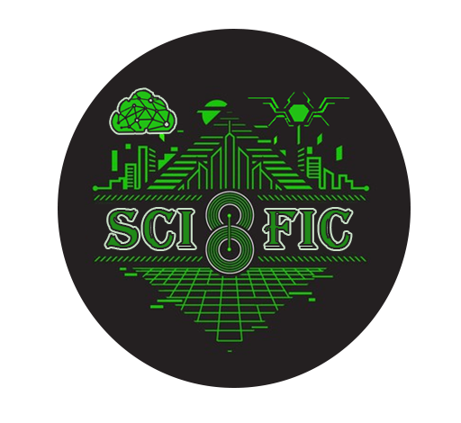

# SCIFiC — International Student Conference on Cybersecurity



Welcome to the official repository of the **5th International Student Conference on Cybersecurity (SCIFiC)**, held at the Department of Computer Systems, Networks and Cybersecurity, National Aerospace University "KhAI", Kharkiv, Ukraine.

---

## 🌐 [Visit the Conference Website](https://scific-conference.github.io/SCIFIC-conference/)

---

## 🚀 About the Conference

SCIFiC is an annual international student conference dedicated to cybersecurity, information security, functional safety, and legal aspects of cyber protection. The event brings together students, young researchers, and professionals to share knowledge, present research, and discuss the latest trends in cybersecurity.

- **Dates:** November 27–28, 2025
- **Location:** NAU "KhAI", Kharkiv, Ukraine (Online)
- **Languages:** English, Ukrainian
- **Participation:** Free (printed proceedings available for a fee)

---

## 🖥️ Features

- **Modern cyberpunk design** with digital rain and glitch effects
- **Multilingual support** (EN/UA) — instant language switcher
- **Responsive layout** for desktop and mobile
- **Dynamic schedule and sections** with direct Google Meet links
- **Archive of previous years’ proceedings**
- **FAQ and contact forms**
- **Animated loading screen and countdown timer**
- **Easy navigation and accessibility**

---

## 📂 Project Structure

```
/
├── index.html         # Main HTML file (see код.docx)
├── styles.css         # Main stylesheet
├── script.js          # Main JavaScript (included in index.html)
├── images/            # Conference and section images, icons, logos
├── image_archive/     # Archive covers for previous years
├── 4zx5d0amk2.ico     # Favicon
├── README.md          # This file
└── ...                # Other assets (see repo)
```

---

## 🛠️ Getting Started

### 1. **Clone the repository**

```bash
git clone https://github.com/scific-conference/SCIFIC-conference.git
cd SCIFIC-conference
```

### 2. **Open locally**

Just open `index.html` in your browser. All styles and scripts are included or loaded via CDN.

### 3. **Deploy to GitHub Pages**

1. Push your changes to the `main` branch.
2. In your repository settings, enable GitHub Pages and set the source to the `main` branch.
3. Your site will be available at `https://<your-username>.github.io/SCIFIC-conference/`.

---

## 📝 Conference Sections

- **Plenary Session**
- **Section 1:** Information and Cybersecurity
- **Section 2:** Functional Safety
- **Section 3:** Legal Provision of Cybersecurity

Each section has its own Google Meet link and calendar integration.

---

## 📅 Schedule Example

| Tasks                                      | First day         | Second day        |
|---------------------------------------------|-------------------|-------------------|
| Registration and connection verification    | 02:45 – 03:00 pm  | 09:45 – 10:00 am  |
| Plenary session                            | 03:00 – 04:00 pm  | 10:00 – 10:55 am  |
| Coffee-break                               | 04:00 - 04:05 pm  | 10:55 – 11:00 am  |
| Work of the sections                       | 04:05 - 05:15 pm  | 11:00 am – 12:20 pm |
| ...                                        | ...               | ...               |

---

## 📚 Archive

Access proceedings and materials from previous years (2021–2024) via Google Drive, ResearchGate, and KhAI Library.  
See the **Archive** section on the website for direct links.

---

## 📝 How to Participate

- **Register:** [Google Form](https://forms.gle/SqmMuFce2XWfuNxp8)
- **Submit Abstracts:** Upload `.doc` or `.docx` files named as `SURNAME-Group-Section-Title.docx`
- **Templates:** [EN Template](https://drive.google.com/drive/folders/1ktg8FOQ__DUgoMT-h3jEWuMpgGRrn9pF) | [UA Template](https://drive.google.com/drive/folders/17EnEdAhusTHWuP9lOsJ9Oq4YfdM-K1Mj)
- **Deadline:** November 15, 2025

---

## ❓ FAQ

- **Format:** Online (Google Meet)
- **Languages:** Ukrainian, English
- **Certificates:** All participants receive e-certificates
- **ISBN:** Proceedings are published with ISBN
- **Participation:** Free (printed version available for a fee)

See the FAQ section on the website for more details.

---

## 👥 Contacts

**Organizing Committee:**  
- Prof. Volodymir Pevnev (Chair)  
- Prof. Vyacheslav Kharchenko (Program Committee)  
- Dr. Heorhii Zemlianko (Technical Support)  
- Email: [scific@csn.khai.edu](mailto:scific@csn.khai.edu)  
- Address: National Aerospace University "KhAI", vul. Vadyma Manka 17, Kharkiv, Ukraine

---

## 🤝 Partners

- National Aerospace University "KhAI"
- [Department of Computer Systems, Networks and Cybersecurity](https://education.khai.edu/department/503)
- [IEEE](https://www.ieee.org)
- [Microsoft](https://www.microsoft.com)
- [Cisco](https://www.cisco.com)

---

## 💡 Contributing

Pull requests are welcome!  
If you want to improve the site, add new features, or fix bugs, please fork the repository and submit a PR.

---

## 📜 License

This project is open-source and available under the MIT License.

---

## 🙏 Acknowledgements

Developed and maintained by [Heorhii Zemlianko](https://github.com/HeorhiiZemlianko).  
Special thanks to all contributors and the SCIFiC community!

---

> _"Cyberthreats evolve — we learn faster. Share expertise at our conference!"_

---

**[⬆ Back to top](#scific--international-student-conference-on-cybersecurity)**

---

> _For more details, visit the [official website](https://scific-conference.github.io/SCIFIC-conference/) or contact the organizing committee._

---
